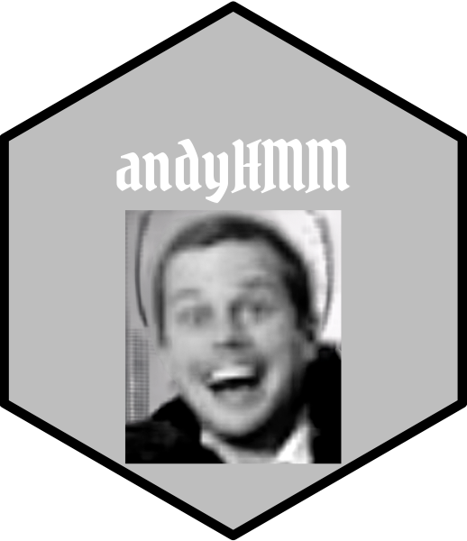

```{r, include = FALSE}
knitr::opts_chunk$set(
  collapse = TRUE,
  comment = "#>",
  fig.path = "man/figures/README-",
  out.width = "100%"
)
```

```{r echo=FALSE, results="hide", message=FALSE}
library(badger)
library(hexSticker)

library(showtext)
## Loading Google fonts (http://www.google.com/fonts)
font_add_google("Bokor", "bokor")
## Automatically use showtext to render text for future devices
showtext_auto()

imgurl <- system.file("figures/andyHMM.png", package="andyHMM")
sticker(imgurl, package="andyHMM", p_size=20, s_x=1, s_y=.75, s_width=.4, s_height = 0.4,
        h_fill="grey", h_color="black", p_family = "bokor",
        filename="inst/figures/imgfile.png")
```

# andyHMM



<!-- badges: start -->
`r badge_lifecycle(stage = "experimental")`
<!-- badges: end -->

Basic implementation of the Hidden Markov Algorithms described in [Rabiner, 1989](https://ieeexplore.ieee.org/document/18626). Odds are: something in this package does not work as intended; use at your own risk. Currently only implements functions for discrete output models with time-homogeneous transition matrices; see package `depmixS4` for a more full-featured HMM suite.

## Functions

* `simulate_hmm`: simulate sequence of observations (x) and hidden states (z) for a simple HMM defined by an initial probability vector (pi), an NxN transition matrix (A), and a NxK emission probability matrix (B)
* `forward_algorithm`: for a given HMM and a sequence of observations, compute the likelihood of the observed sequences (integratin over the set of all possible underlying hidden states)
* `viterbi` and `viterbi_log`: For a given HMM and sequence of observed states compute the most likely sequence of underlying hidden states. `viterbi_log` uses log-probabilities in its calculations
* `update_parameters`: run one iteration of the Baum-Welch algorithm to update parameter estimates for a HMM


